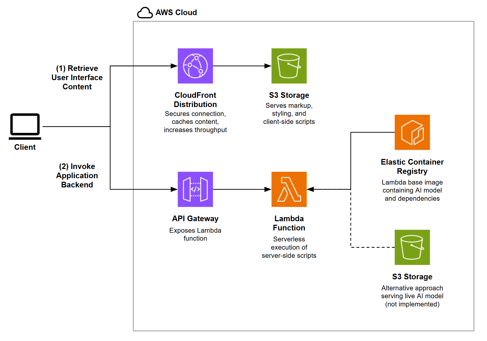

# Abstract Generator
A machine learning model trained to generate the text of academic abstracts, hosted at https://yahianassab.com/abstractgenerator.

The original dataset was provided by ArXiv (operated by Cornell University) on Kaggle under a CC0 Public Domain license.
https://www.kaggle.com/datasets/Cornell-University/arxiv.

The TensorFlow wheel used in this project can be downloaded from PyPI: https://pypi.org/project/tensorflow/2.9.2/#files.

## Model Design

The model uses a **Gated Recurrent Unit (GRU)** architecture with ~700,000 trainable parameters, comprised of a 500-character scanning window, each with a 256-dimension embedding and 1024-dimension GRU, in addition to a 109-dimension output layer matching the vobulary size.

The purpose of this project largely being a learning exercise for the author is the primary reason behind the choice of GRU over other architectures (e.g., Transformer) &mdash; it consumes relatively few computing resources while offering reasonable ability to capture medium-range dependencies, appropriate for paragraph-length academic abstracts.

The model uses **character-level tokenization** rather than word-level or subword tokenization so that it can produce inferences even with few trainable parameters, a necessary requirement given that the model was trained on a machine with limited memory capacity. The consequence of this choice is that it hinders the model's ability to produce coherent grammar, since more of its resources are required to construct words correctly to maintain the loss function at a minimum.

Furthermore, memory capacity constraints dictated the choice of training parameter values. Rather than sacrifice long-range coherence by decreasing the input sequence length of 500, a **long training time** was opted for instead by selecting a low batch size of 16. Experimentation, meanwhile, led to the selected learning rate of $10^{-4}$, which maintained long-term stability during training. In contrast, a learning rate of $5 \times 10^{-3}$ results in increasing loss over time as the optimizer is unable to remain stable within the vicinity of any local minima at such a high temperature.

## Training

The model was trained for 240 epochs, which is the point at which the second decimal place of the sparse categorical cross-entropy (SCC) loss would remain static for at least 100 more epochs based on the following projection. Loss evolution over training follows a $1/x$ relation:

$L(n) = \frac{a}{n+b} + c$

Where $L(n)$ is the loss and $n$ is the number of training epochs. Regression-fitting and extrapolating allows one to project the training time for a target loss with a precision of 3 significant figures:

```
(a,b,c), covariance = scipy.optimize.curve_fit(lambda t,a,b,c: a/(x+b) + c,  x,  y,  p0=(1, 0, 0.80))
```


<br>

`generate_sample_text.py` may be executed to sample the trained model in a development environment without the web application interface. The default seed is "Herein, we describe a model for", which can be modified by passing a `seed` parameter to `model.generate_text()`.

## Web Application

### Serverless Architecture
AWS Lambda is used for model inference to maintain low-cost resource allocation given that the application is not projected to see sufficient usage for a persistent server. This presents specific challenges which were addressed with the following design choices:

1. **Container-hosted function**: The Lambda function is packaged and loaded from a Docker container managed in Elastic Container Repository (ECR) to overcome the maximum size limitation for a standard Lambda function, necessary to store the large TensorFlow module.

2. **Wake-up call to Lambda**: When activated, the Lambda function typically takes 15+ seconds to spin up due its large size. Thus, an initial empty request was added to "wake up" the function when the page loads, reducing the cold start latency for the first real request.

3. **CPU-only inference**: A model that was trained on a GPU may still produce inferences with a CPU, which is what this model does without access to a GPU in the Lambda environment.

### Model Parameter Loading

There were two approaches considered for loading the trained model's weights and biases:

1. **Store the parameters in S3** while the module dependencies remain in the ECR container, which makes it easier to update the model parameters independently of the Lambda function, allowing for real-time training. However, since the Lambda is stateless, it would need to fetch the S3 contents in each request, increasing the request's latency by ~500ms (~10ms per megabyte).
2. **Store the parameters in ECR** along with the dependencies, which allows them to persist in Lambda memory after being loaded once during cold start.

Since there was no desire to have the model train in production, the second approach was chosen for improved latency. However, the implementation can be easily switched to the first approach if needed by replacing the line in the function code in which the parameters are loaded with a fetch to S3, notwithstanding the solutioning required to continuously train the model to produce the parameters being fetched.


