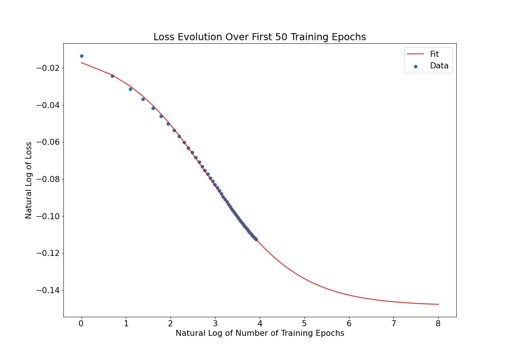

# arxiv-ml
The original dataset was provided courtesy of ArXiv (operated by Cornell University) on Kaggle under a CC0 Public Domain license.
https://www.kaggle.com/datasets/Cornell-University/arxiv

For the purposes of this project, the dataset was cleaned and the abstracts data was amalgamated into a single plain-text file which can be downloaded at https://yahianassab.com/download-arxiv-ml.html

## Architecture
The model is a Recurrent Neural Network (RNN) with ~700,000 trainable parameters. The input is a "window" sequence of 500 characters that scans across the sample text and the model is evaluated by its ability to predict the character following the end of the window. Each input character is mapped to a vector with 256 dimensions, and this is used to train a series of Gated Recurrent Units (GRU), each with 1024 units. The GRU "forgets" irrelevant past data as it trains, which allows it to retain the influence of important data over a longer period, resulting in more coherent generated text. The output generated is any one of the 109 unique characters in the sample text (letters, numbers, and special characters).

## Design Choices
As a trade-off of training speed in exchange for long-range coherence, a long input sequence length of 500 is used, while a low batch size of 16 retains the training program within memory constraints. Additionally, a slow learning rate of $10^{-4}$ is used which maintains stability while training. A typical learning rate of, say, $5 \times 10^{-3}$ results in increasing loss over time since the optimizer temperature is too high to remain inside the minima of the parameter space. Finally, the training method is a real-time recurrent learning (RTRL) scheme, where the model weights are updated by using the partial derivatives of the model's output with respect to its weights. This is as opposed to a traditional back-propagation through time (BPTT) scheme, which is vulnerable to vanishing and exploding gradients.

## Training

The model was trained for 240 epochs, which is the point at which the sparse categorical cross-entropy (SCC) loss converged to the second decimal place (or, more accurately, that the second decimal place would remain static for at least 100 more epochs). Loss evolution over training follows a $1/x$ relation:

$L(n) = \frac{a}{n+b} + c$

Where $L(n)$ is the loss and $n$ is the number of training epochs. Regression-fitting and extrapolating allows one to project the training time for a target loss with a precision of 3 significant figures:

```
(a,b,c), covariance = scipy.optimize.curve_fit(lambda t,a,b,c: a/(x+b) + c,  x,  y,  p0=(1, 0, 0.80))
```



## Usage
`230103_generate_text.py` may be executed to generate text using the trained model. Below is an example of text that the algorithm produces. Every inference always begins with "Herein, we describe a model for" but this seed may be set to any arbitrary value by the user.

> Herein, we describe a new model for the compound fracture. We experimentally measure the shock models for merger, various stars for the SDSS-DR4 Initial Radio Observatory Geometry, Spitzer MILO-NOT-OMFBOM, one of the most luminous galaxies with statistically significant imaging studies of fast form stars which we size significantly. Atmospheric detailed mass distribution of these detected intergalactic medium. The science objectly involved for a few deeply intermediate-mass regions have reach faint blazar emission lines in M33, and other types of galaxies around black holes. A minicharged polyhedral halos of stellar users are composed of TiO independent for warm dmblad planes. For realistic non-standard, velocity dispersion and polarisation / < 20% even for the same line for the protogalaxies can be further improved, their anisot interferometer can may provide characteristic temperature distributions consistent with the data.
